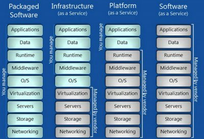

## mesos 名词 解释

1. Mesos-master: Mesos master，主要负责管理各个framework和slave，并将slave上的资源分配给各个framework
2. Mesos-slave: Mesos slave，负责管理本节点上的各个mesos-task，比如: 为各个executor分配资源
3. Framework: 计算框架，如: Hadoop，Spark等，通过MesosSchedulerDiver接入Mesos
4. Scheduler: 调度器, ...
5. Executor: 执行器，安装到mesos-slave上，用于启动计算框架中的task。
6. Framework schedule : framework 调度器
7. clusters : 集群(计算机集群),是一种计算机系统， 它通过一组松散集成的计算机软件或硬件连接起来高度紧密地协作完成计算工作。在某种意义上，他们可以被看作是一台计算机。
8. node : 节点, 集群系统中的单个计算机通常称为节点
9. 热备份: 热备份是系统处于正常运转状态下的备份

## \_aaS : as-a-Service

IaaS、PaaS、SaaS、CaaS、MaaS 的区别:  

都是云计算服务的产物,云计算是什么?  

#### 云计算
云计算(cloud computing) 基于互联网的相关服务的增加、使用和交付模式，通常涉及通过互联网来提供动态易扩展且经常是虚拟化的资源.  
基于互联网的相关服务的增加、使用和交付模式，通常涉及通过互联网来提供动态易扩展且经常是虚拟化的资源.  

#### IaaS: Infrastructure-as-a-Service（基础设施即服务）

第一层叫做IaaS，有时候也叫做Hardware-as-a-Service。(硬件即服务)  

#### PaaS: Platform-as-a-Service（平台即服务）

第二层就是所谓的PaaS，某些时候也叫做中间件

### SaaS: Software-as-a-Service（软件即服务）

### CaaS是Communications-as-a-Service缩写，意思是通讯即服务(也可称为协作即服务).

CaaS是将传统电信的能力如消息、语音、视频、会议、通信协同等封装成API(Application Programming Interface，应用软件编程接口)或者SDK(Software Development Kit，软件开发工具包)通过互联网对外开放，提供给第三方（企业、SME、垂直行业、CP/SP以及个人开发者等等）使用，将电信能力真正作为服务对外提供.

### CaaS Container as a Service ?

- - -
